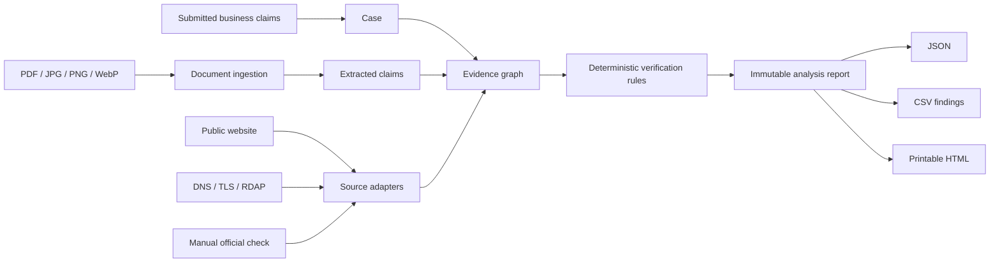
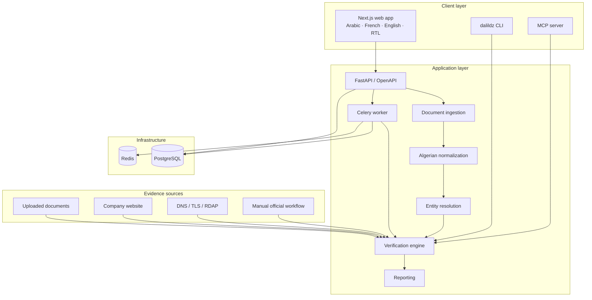
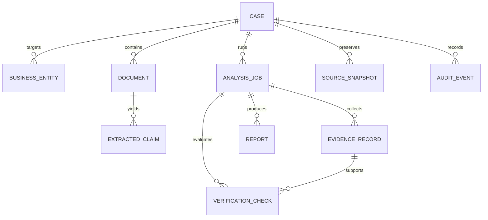
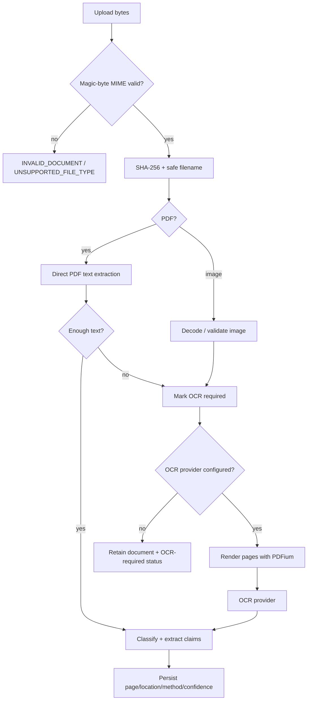

# DalilDZ

> **Open-source evidence engine for Algerian business verification.**

[](https://github.com/dinogx99/DalilDZ/actions/workflows/ci.yml)
[](https://github.com/dinogx99/DalilDZ/actions/workflows/codeql.yml)
[](https://github.com/dinogx99/DalilDZ/actions/workflows/security.yml)


DalilDZ is a provenance-first verification workspace for Algerian business information. It accepts submitted claims and commercial documents, extracts structured identity evidence, compares values with deterministic rules where possible, collects limited public technical evidence, and generates an auditable report that explains **what was checked, against what, when, by which method, and with which result**.

**DalilDZ is not a fraud detector and does not produce a trust score.**

---

## Why this project exists

Vendor and merchant verification often becomes a folder of invoices, screenshots, email threads, web searches and handwritten notes. The difficult part is not collecting more data; it is retaining enough provenance to answer basic questions later:

- Where did this RC number come from?
- Did the invoice and the submitted supplier record contain the same NIF?
- Is a legal-form difference merely punctuation, or a real SARL/EURL conflict?
- Was a field absent, or was the source itself unavailable?
- Was a conclusion produced from an exact rule or from fuzzy text similarity?
- Can another reviewer reproduce the result next month?

DalilDZ turns that process into a structured evidence trail.

### What makes DalilDZ different

| Design principle | What it means in practice |
| --- | --- |
| **Evidence, not reputation** | The system reports evidence states; it never labels a company “safe”, “fraudulent” or “trustworthy”. |
| **Deterministic first** | RC/NIF/NIS/AI, legal-form, wilaya and other rule-based checks do not need an LLM. |
| **Algeria-oriented normalization** | Arabic/French/Latin text, Algerian legal forms, phone numbers, 58 wilayas and mixed-script business names are normalized explicitly. |
| **Provenance survives analysis** | Evidence records retain source, method, document hash, page/location, retrieval time and snapshot hash where applicable. |
| **Source failure is a first-class state** | `SOURCE_UNAVAILABLE` is not silently converted into `NOT_FOUND`. |
| **History is not rewritten** | Analysis jobs and reports are stored as historical snapshots; a refresh produces a new analysis rather than overwriting the previous one. |
| **Lawful source architecture** | A source that cannot be safely/legally automated can be `MANUAL_ONLY` without blocking the rest of the workflow. |
| **AI is subordinate to evidence** | Optional AI providers can interpret difficult text, but deterministic evidence has precedence. |

---

## Evidence model



The core relationship is deliberately simple:

```text
BusinessEntity
   └── Claims
        └── EvidenceRecord(s)
             └── VerificationCheck(s)
                  └── Report snapshot
```

A finding is useful only if a reviewer can trace it back to evidence.

### Example

Submitted:

```text
Company: SARL ALPHA DISTRIBUTION
RC:      16B0123456
Wilaya:  Oran
```

Document evidence:

```text
Raison sociale: Alpha Distribution S.A.R.L.
RC:              16 B 0123456
Wilaya:          Alger
```

Possible DalilDZ output:

| Field | Submitted | Observed | Status | Method |
| --- | --- | --- | --- | --- |
| Legal name | SARL ALPHA DISTRIBUTION | Alpha Distribution S.A.R.L. | CONSISTENT | normalized token-set similarity |
| RC | 16B0123456 | 16 B 0123456 | VERIFIED | exact normalized identifier |
| Wilaya | Oran | Alger | CONFLICTING | Algerian wilaya normalization |

That is **not** a conclusion about whether the company is legitimate. It is an evidence statement about the supplied information.

---

## Status semantics

DalilDZ uses a strict status model.

| Status | Meaning |
| --- | --- |
| `VERIFIED` | The submitted value matches sufficiently authoritative/comparable evidence using a deterministic rule. |
| `CONSISTENT` | Evidence is compatible with the claim, but the check is not represented as an authoritative verification. |
| `CONFLICTING` | Comparable values disagree under a deterministic rule. |
| `NOT_FOUND` | A functioning source was searched and the relevant record/value was not found. This status must not be used merely because a source failed. |
| `NOT_VERIFIABLE` | No sufficient evidence path is available for the field. |
| `SOURCE_UNAVAILABLE` | A relevant automated source failed or was unavailable. |
| `OUTDATED` | Evidence exists but is known to be outside an accepted freshness window. |
| `MANUAL_REVIEW_REQUIRED` | The source or comparison needs a human decision or official manual check. |

There is intentionally **no global trust score**.

---

## Architecture



### Core persisted entities



See [docs/ARCHITECTURE.md](docs/ARCHITECTURE.md) for module boundaries and data-flow details.

---

## Current source integrations

The project deliberately distinguishes implemented automation from scaffolds and manual workflows.

| Source | Mode | Current state | Notes |
| --- | --- | --- | --- |
| Uploaded PDF documents | Local | **Implemented** | Direct text extraction first; SHA-256 and claim provenance retained. |
| Uploaded JPG/PNG/WebP | Local | **Implemented** | MIME verified from bytes; marked OCR-required when needed. |
| PaddleOCR | Local optional | **Experimental / optional** | Provider is implemented but not installed in the minimal image by default because Paddle runtime selection is platform-specific. |
| Submitted company website | Automated public | **Implemented** | Bounded fetch, robots handling, redirect validation, response-size cap, visible claim extraction. |
| DNS | Automated public | **Implemented** | Public-address resolution; private/internal targets are blocked. |
| TLS certificate metadata | Automated public | **Implemented** | Certificate CN/issuer/dates/protocol metadata. |
| RDAP | Automated public | **Implemented** | Uses public RDAP routing; unavailable/hidden registration data is reported as such. |
| CNRC / Sidjilcom | Official | **MANUAL_ONLY** | No undocumented API or CAPTCHA bypass is claimed. Manual confirmation can be stored with provenance. |
| Optional LLM provider | Local / configured | **Provider abstraction implemented** | Disabled by default. Ollama and OpenAI-compatible endpoints are supported; deterministic checks remain authoritative. |

See [docs/DATA_SOURCES.md](docs/DATA_SOURCES.md).

---

## Document pipeline



Supported upload types:

- PDF
- JPG / JPEG
- PNG
- WebP

Deterministic extraction currently targets common identifiers and contact fields such as RC, NIF, NIS, AI, email, phone, website, legal form, invoice number and labelled company name.

---

## Algerian normalization

The normalization package is intentionally independent of the UI and source adapters so contributors can reuse and test it directly.

Examples:

```text
"S.A.R.L. Alpha Distribution"  → "alpha distribution"
"16 B-0123456"                 → "16B0123456"
"١٦ B ٠١٢٣٤٥٦"                → "16B0123456"
"وهران"                        → "Oran"
"31"                           → "Oran"
"0550 12 34 56"                → "+213550123456"
```

It includes:

- Arabic diacritic removal and character normalization
- Arabic numeral normalization
- French/Latin accent and punctuation normalization
- SARL, EURL, SPA, SNC and SCS recognition
- all 58 wilayas in Latin and Arabic forms
- approximate Arabic→Latin transliteration for cross-script name comparison
- Algerian phone normalization
- canonical domain extraction

See [docs/ENTITY_RESOLUTION.md](docs/ENTITY_RESOLUTION.md).

---

## Quick start with Docker

Requirements:

- Docker Engine / Docker Desktop with Compose v2
- around 2 GB free memory for the default stack; optional OCR requires more

```bash
git clone https://github.com/dinogx99/DalilDZ.git
cd DalilDZ
docker compose up --build
```

Services:

| Service | Address |
| --- | --- |
| Web app | http://localhost:3000 |
| REST API | http://localhost:8000 |
| OpenAPI / Swagger | http://localhost:8000/docs |
| API health | http://localhost:8000/api/v1/health |
| PostgreSQL | internal Compose network |
| Redis | internal Compose network |
| Celery worker | internal Compose network |

The backend applies the Alembic baseline migration at startup.

### Local development

```bash
make setup
make test
make lint
```

Or:

```bash
python -m pip install -e "backend[dev]"
cd frontend && npm install
```

Configuration is documented in [.env.example](.env.example).

---

## Web workflow

1. Create a verification case.
2. Enter known claims such as company name, RC, NIF, website and wilaya.
3. Upload business documents.
4. Add manual official-source evidence when an official service cannot be automated lawfully.
5. Run analysis synchronously or queue it through the Celery endpoint.
6. Review field-by-field evidence and explanations.
7. Export JSON, CSV findings or printable HTML.
8. Refresh later to create a new historical analysis snapshot.

The UI is available in Arabic, French and English. Arabic uses an RTL layout.

---

## REST API

FastAPI publishes an OpenAPI schema automatically.

Core routes include:

```text
GET    /api/v1/health
GET    /api/v1/cases
POST   /api/v1/cases
GET    /api/v1/cases/{id}
PATCH  /api/v1/cases/{id}
DELETE /api/v1/cases/{id}

POST   /api/v1/cases/{id}/claims
POST   /api/v1/cases/{id}/documents
POST   /api/v1/cases/{id}/manual-evidence
POST   /api/v1/cases/{id}/analyze
POST   /api/v1/cases/{id}/analyze/background
POST   /api/v1/cases/{id}/refresh

GET    /api/v1/cases/{id}/evidence
GET    /api/v1/cases/{id}/checks
GET    /api/v1/cases/{id}/jobs
GET    /api/v1/cases/{id}/timeline
GET    /api/v1/cases/{id}/report
GET    /api/v1/cases/{id}/report.csv
GET    /api/v1/cases/{id}/report.html

POST   /api/v1/entity-resolution
POST   /api/v1/bulk/import
GET    /api/v1/sources
GET    /api/v1/sources/health
```

Example:

```bash
curl -X POST http://localhost:8000/api/v1/cases \
  -H 'content-type: application/json' \
  -d '{
    "name": "SYNTHETIC ALPHA DISTRIBUTION",
    "claims": {
      "legal_name": "SYNTHETIC ALPHA DISTRIBUTION",
      "rc": "16B0123456",
      "wilaya": "Oran"
    }
  }'
```

The examples and fixtures in this repository use **SYNTHETIC TEST DATA**.

See [docs/API.md](docs/API.md).

---

## Manual official verification

When a government or official source cannot be automated safely, a reviewer can record a manually confirmed value:

```text
source_id: user_confirmed_official_source
method:    USER_CONFIRMED_FROM_OFFICIAL_SOURCE
field:     rc
value:     16B0123456
source:    reviewer-supplied official URL/name
```

This is preferable to brittle scraping, CAPTCHA bypasses or fabricated API integrations.

---

## Bulk vendor verification

Procurement and accounting teams can import CSV or XLSX vendor lists.

Recognized columns:

```text
company_name
rc
nif
website
wilaya
legal_form
```

The import endpoint creates cases; analysis remains evidence-based per case. The default safety limit is 1,000 rows per import.

---

## CLI

After installing the backend package:

```bash
dalildz doctor
dalildz sources
dalildz document invoice.pdf

dalildz verify \
  --name "SARL ALPHA DISTRIBUTION" \
  --rc "16B0123456" \
  --observed-name "Alpha Distribution S.A.R.L" \
  --observed-rc "16 B 0123456"

dalildz report CASE_ID
```

The CLI uses the same normalization and entity-resolution logic as the application.

---

## MCP server

DalilDZ exposes core capabilities through an MCP server using the official Python SDK.

Current tools:

- `compare_business_claims`
- `resolve_algerian_entity`
- `create_verification_case`
- `parse_business_document`
- `get_case_evidence`
- `generate_evidence_report`
- `check_source_status`

After backend installation:

```bash
dalildz-mcp
```

Example client configuration:

```json
{
  "mcpServers": {
    "dalildz": {
      "command": "dalildz-mcp",
      "env": {
        "DATABASE_URL": "sqlite:///./dalildz-mcp.db",
        "OCR_PROVIDER": "none",
        "AI_PROVIDER": "none"
      }
    }
  }
}
```

See [docs/MCP.md](docs/MCP.md).

---

## Adding an Algerian evidence source

Source integrations implement one interface and do not modify the verification engine:

```python
class MyNewAlgerianSource(EvidenceSourceAdapter):
    source_id = "my_source"
    display_name = "My source"
    source_type = "PUBLIC_OR_OFFICIAL"
    supported_fields = ("rc", "nif")

    async def health_check(self) -> SourceHealth:
        ...

    async def collect(self, claims: dict[str, str]) -> CollectionResult:
        ...
```

Every adapter must state:

- whether it is official or public
- whether automation is allowed/available
- supported fields
- current health
- limitations
- source URLs/snapshot hashes where appropriate

See [docs/ADDING_A_SOURCE.md](docs/ADDING_A_SOURCE.md).

---

## Security model

DalilDZ handles potentially sensitive commercial documents and treats external-source access as untrusted.

Implemented controls include:

- MIME verification from bytes
- upload-size limits
- SHA-256 file fingerprints
- sanitized display filenames and UUID internal identifiers
- ORM/parameterized database access
- secrets only from environment variables
- no telemetry by default
- request correlation IDs
- security headers
- bounded in-memory rate limiting
- SSRF rejection for loopback, private, link-local and metadata targets
- redirect re-validation
- HTTP timeout / response-size / redirect caps
- identifiable crawler User-Agent
- robots handling for website collection
- non-root backend and frontend containers
- CodeQL
- Python and npm dependency audits
- Dependabot configuration

There is no claim that the system is immune to every SSRF/DNS-rebinding or parser attack. See [SECURITY.md](SECURITY.md) for the threat model and remaining risks.

---

## Privacy

Default behavior:

- no telemetry
- no third-party AI calls
- no document content in structured access logs
- no API keys in source control
- uploaded content stays in the configured deployment environment

If an operator enables an external AI provider, that changes the privacy boundary and must be evaluated by the operator.

See [docs/PRIVACY.md](docs/PRIVACY.md).

---

## Quality gates

The repository includes:

- Python compile checks
- Ruff linting
- backend unit/integration/API tests
- entity-resolution evaluation fixtures
- TypeScript type checking
- Next.js production build
- Docker Compose build + API health smoke test
- CodeQL
- `pip-audit`
- `npm audit`
- Dependabot

Synthetic evaluation data lives under [evals/entity_resolution](evals/entity_resolution/).

---

## Repository structure

```text
dalildz/
├── backend/
│   ├── alembic/
│   ├── app/
│   │   ├── ai/
│   │   ├── api/
│   │   ├── core/
│   │   ├── entity_resolution/
│   │   ├── extraction/
│   │   ├── mcp/
│   │   ├── models/
│   │   ├── normalization/
│   │   ├── services/
│   │   ├── sources/
│   │   └── workers/
│   └── tests/
├── frontend/
│   ├── app/
│   ├── components/
│   ├── lib/
│   └── public/
├── docs/
├── evals/
├── fixtures/
├── scripts/
├── .github/
├── docker-compose.yml
└── Makefile
```

---

## What DalilDZ does **not** do

DalilDZ does not:

- declare that a company is trustworthy
- declare that a merchant is fraudulent
- determine solvency
- determine safety
- generate a global trust/reputation score
- bypass CAPTCHAs, authentication, paywalls, robots restrictions or rate limits
- fabricate official Algerian records
- claim a live CNRC API integration where none has been implemented
- treat domain age or TLS as proof of legitimacy
- allow AI interpretation to override deterministic identifier evidence

---

## Known limitations

Current limitations are kept explicit:

1. **CNRC/Sidjilcom is manual-only.** A lawful documented automated interface can be added later through the adapter system.
2. **OCR is optional.** The default Docker image does not bundle PaddlePaddle because CPU/GPU runtimes are platform-specific.
3. **Website intelligence is intentionally shallow.** DalilDZ does not crawl entire sites.
4. **PDF export is not bundled yet.** Printable HTML is available and can be printed to PDF by the browser.
5. **No multi-user authentication layer is included in v1.0.** Deploy behind appropriate access control when documents are sensitive.
6. **Cross-script transliteration is approximate.** Ambiguous entity matches remain reviewable instead of being silently merged.
7. **Public technical metadata is supporting evidence only.** DNS/TLS/RDAP cannot establish legal status.

See [ROADMAP.md](ROADMAP.md).

---

## Contributing

Contributions are welcome, particularly for:

- documented lawful Algerian public-data sources
- Arabic/French extraction fixtures
- normalization edge cases
- document-classification rules
- source-health monitoring
- OCR provider testing across CPU/GPU environments
- accessibility and RTL improvements

Before contributing a source integration, read [docs/ADDING_A_SOURCE.md](docs/ADDING_A_SOURCE.md).

---

## License

Apache License 2.0. See [LICENSE](LICENSE).

---

### Disclaimer

> DalilDZ does not determine whether an entity is trustworthy, solvent, legitimate, fraudulent, or safe. It reports evidence and inconsistencies found in supplied and publicly available information.
