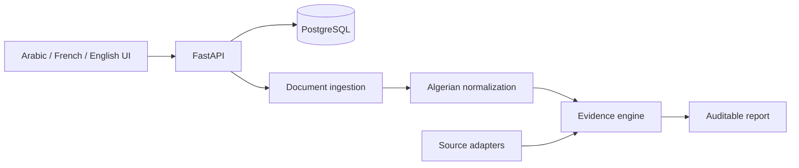

# DalilDZ

**Open-source evidence engine for Algerian business verification.**

DalilDZ compares submitted business claims with document evidence and extensible evidence sources. It reports explicit evidence statuses and **does not produce a trust score or declare a company safe/fraudulent**.

## Quick start

```bash
git clone https://github.com/dinogx99/DalilDZ.git
cd DalilDZ
docker compose up --build
```

Web: `http://localhost:3000` · API/OpenAPI: `http://localhost:8000/docs`

## Architecture



## v1.0 implementation

- Case CRUD and documented REST API.
- PDF/JPG/PNG/WebP signature validation and SHA-256 provenance.
- Direct PDF text extraction; modular path for OCR providers.
- RC/NIF/NIS/contact extraction.
- Arabic/French/Latin normalization and Algerian legal-form normalization.
- Deterministic identifier checks and explainable fuzzy name matching.
- Evidence statuses: VERIFIED, CONSISTENT, CONFLICTING, NOT_FOUND, NOT_VERIFIABLE, SOURCE_UNAVAILABLE, OUTDATED, MANUAL_REVIEW_REQUIRED.
- Source adapter interface and source health model.
- CNRC/Sidjilcom intentionally marked MANUAL_ONLY; no undocumented government API is claimed.
- SSRF protections for future website intelligence adapters.
- Trilingual responsive Next.js UI with Arabic RTL.
- CLI and MCP tool-registry foundation.
- Synthetic demo fixtures and automated backend tests.
- Docker Compose with frontend, backend and PostgreSQL.

## Limitations

v1.0 does not claim a live automated CNRC integration. Image OCR is provider-extensible but a production OCR engine is not bundled in the minimal Docker image yet. DNS/RDAP/TLS is represented by an adapter scaffold and must not be described as a completed intelligence collector until its collection methods are implemented.

## License

Apache-2.0.
