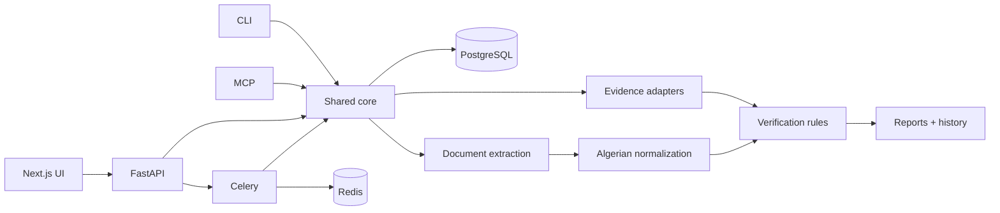
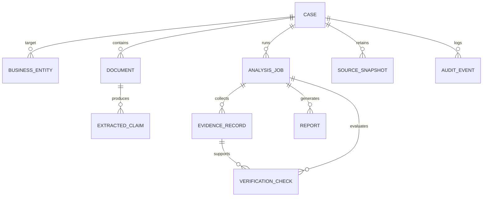

# DalilDZ Architecture

DalilDZ is designed around one invariant: **a verification conclusion must be traceable to evidence**.

## Layers



### Presentation
The Next.js application is a workflow client. Business decisions do not live in React components.

### API
FastAPI validates input, records audit events and calls shared services. OpenAPI is generated from the same routes used by the UI.

### Domain/core
`app.core.domain` defines evidence statuses and deterministic comparisons. Normalization lives in a separate module to keep comparison rules testable.

### Document extraction
The document service performs magic-byte MIME detection, hashes input, extracts digital PDF text first, and invokes an optional OCR provider only when required.

### Sources
Source adapters return evidence plus health state. A source adapter may be automated, degraded, unavailable or manual-only. The verification engine does not contain scraper-specific logic.

### Analysis snapshots
An `AnalysisJob` owns automated evidence and verification checks for one run. A new refresh creates a new job. Existing historical checks are not rewritten.

## Persisted data model



## Failure isolation

External systems are expected to fail. Adapter failure is converted into source health/evidence semantics, not application-wide failure when possible.

```text
source timeout -> SOURCE_UNAVAILABLE
record absent on functioning searched source -> NOT_FOUND
no usable evidence route -> NOT_VERIFIABLE
official/manual-only route -> MANUAL_REVIEW_REQUIRED
```

These states must remain distinct.

## Trust boundaries

1. User uploads are untrusted.
2. User-provided URLs are untrusted.
3. Public website responses are untrusted.
4. Optional AI providers are outside the default trust boundary.
5. Deterministic evidence is authoritative over AI interpretation inside DalilDZ.
